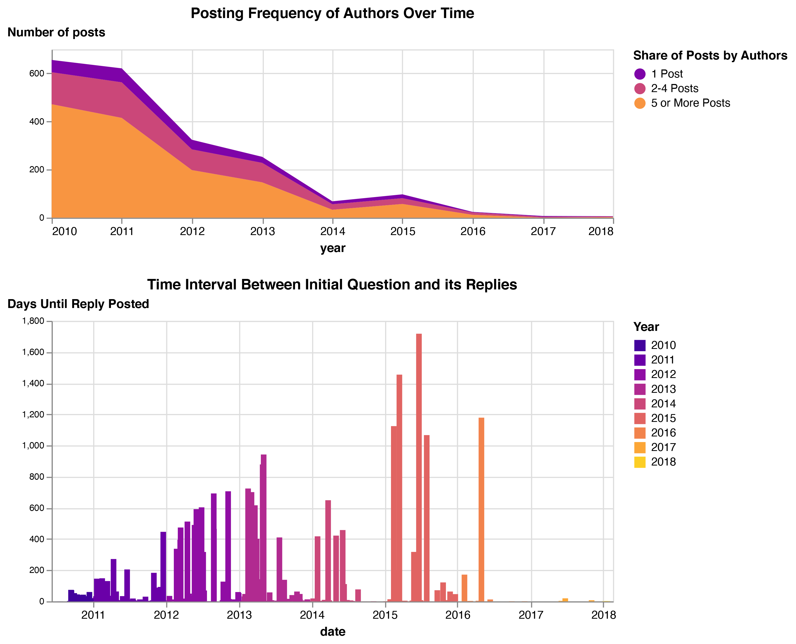

# DH Q&A dataset

This is a dataset generated from the archive of DH Q&amp;A website
content.

## CSV fields

File: [dhqa_data.csv](dhqa_data.csv)

Fields:

* url
* topic_url
* question
* tags
* author
* author_url
* html_content
* content
* date
* relative_date
* snapshot_date
* order
* is_best_answer
* reply_to

## Wayback Machine capture data

To help determine dates for posts that are not present in the RSS feeds
available in the site archive, we downloaded data for topic and rss
URLs from the Internet Archive [Wayback CDX Server API](https://github.com/internetarchive/wayback/tree/master/wayback-cdx-server).

Fields:

* urlkey
* timestamp
* original (original url)
* mimetype
* statuscode
* digest
* length

Files:

* [topic urls](wayback_cdx_topics.json)
* [rss urls](wayback_cdx_rss.json)

## Initial Data Analysis

While we are still currently working on finalizing the dataset, we've started performing some initial data analysis on the forum posts.

First we were interested in the frequency of activity on DH Q&A so we looked at if there were divergent rates of questions or replies posted to the site.

Overall the forum was most active prior to 2014, with the most questions and replies clustered towards late September 2010. We were curious though how much that intense burst of activity was the result of a few very active DHers.

These two graphs attempt to answer this question. The first visualizes that the majority of posts were authored by individuals who published over 5 posts to DH Q&A. The second graph illustrates the length of time between a question being posted and the replies to the question. 

Combined these graphs seem to indicate that DH Q&A was a place for debating topics in the early 2010s, and though the forum continued to be online until 2018, these discussions moved elsewhere much earlier (most likely Twitter or DH Slack).

This is just some initial forays though, and we hope you'll explore this dataset, as well as share your findings.  To follow our data analysis and see the code for generating these graphs, please visit our [Google Colab Notebook](https://colab.research.google.com/drive/1CSdLUMz3fOzUWXxMWUiQaQoOmDddi5oJ#scrollTo=mkSRhPWlP1Eb&line=1&uniqifier=1).