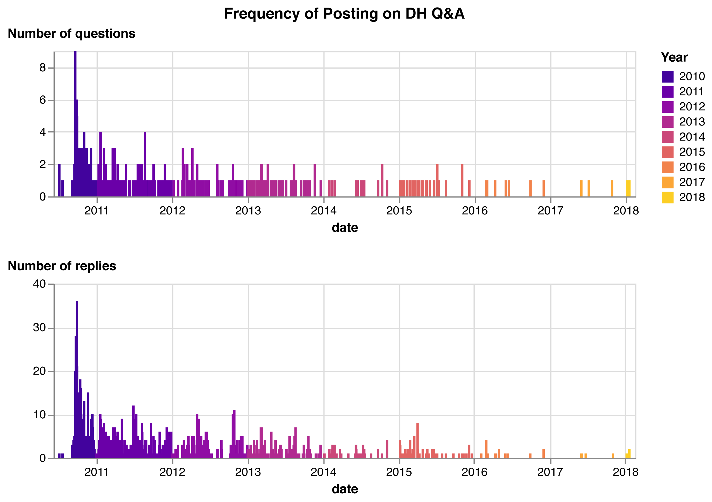

# DH Q&A dataset

This is a dataset generated from the archive of DH Q&amp;A website
content.

## CSV fields

File: [dhqa_data.csv](dhqa_data.csv)

Fields:

* *url* post permalink
* *topic_url* permalink for the topic this post belongs to
* *question* topic question
* *tags* list of tags for the topic
* *author* post author name
* *author_url* post author url
* *html_content* post content with as HTML
* *content* post content in plain text
* *date* date/time the post was published ISO 8601 format (if available)
* *relative_date* relative date text displayed in the HTML, e.g. "3 years ago"
* *snapshot_date* timestamp for the most recent capture of this page in the wayback
* *order* order of the post within the topic
* *is_best_answer* true if the post was marked as a best answer
* *reply_to* permalink for a post if this was a reply to a specific post

### About the dates

The HTML content for posts in the site archive only includes relative dates
(e.g. "Posted 3 years ago"). Fortunately, the RSS feeds do contain full dates
for the publication date of posts. Unfortunately, the RSS feed data is
incomplete — a few RSS feeds were never captured by the Wayback Machine,
while others have some but not all posts for a topic (usually for a
popular topic with many answers).

## Wayback Machine capture data

In the hope that it might help determine dates for posts that are not present
in the RSS feeds available in the site archive, we downloaded data for topic and
rss URLs from the Internet Archive
[Wayback CDX Server API](https://github.com/internetarchive/wayback/tree/master/wayback-cdx-server).

Fields:

* *urlkey* Wayback Machine URL identifier
* *timestamp* timestamp of capture
* *original* original url
* *mimetype* content type
* *statuscode* HTTP status code
* *digest* digest of the content
* *length* size of the content

Files:

* [topic urls](wayback_cdx_topics.json)
* [rss urls](wayback_cdx_rss.json)

## Initial Data Analysis

While we are still currently working on finalizing the dataset, we've started performing some initial data analysis on the forum posts.

First we were interested in the frequency of activity on DH Q&A so we looked at if there were divergent rates of questions or replies posted to the site.

Overall the forum was most active prior to 2014, with the most questions and replies clustered towards late September 2010. We were curious though how much that intense burst of activity was the result of a few very active DHers.

These two graphs attempt to answer this question. The first visualizes that the majority of posts were authored by individuals who published over 5 posts to DH Q&A. The second graph illustrates the length of time between a question being posted and the replies to the question.

Combined these graphs seem to indicate that DH Q&A was a place for debating topics in the early 2010s, and though the forum continued to be online until 2018, these discussions moved elsewhere much earlier (most likely Twitter or DH Slack).

These graphs are only the tip of the iceberg though, and there's lots of full text data here to analyze for those that are interested! To follow our data analysis and see the code for generating these graphs, please visit our [Google Colab Notebook](https://colab.research.google.com/drive/1CSdLUMz3fOzUWXxMWUiQaQoOmDddi5oJ#scrollTo=mkSRhPWlP1Eb&line=1&uniqifier=1). If you do happen to use this dataset, please let us know!